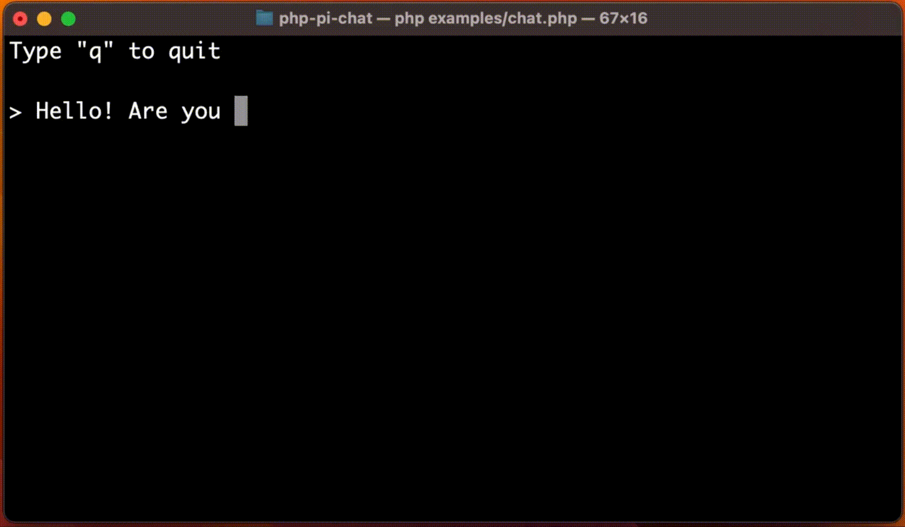

# Pi chatbot client

This is an unofficial python client for **Pi** chatbot (from **Inflection AI**). It doesn't require authentication.

## Installation

    python setup.py

## Demo

Run `python examples/chat.py` to test it.



## Usage

```python
from heypi.client import Client as PiChat
from heypi.prompt import Prompt

chatbot = PiChat()

conversation = chatbot.createConversation()

answer = conversation.ask(new Prompt("Hello World"))
```

<details>
  <summary>Real-time / progressive answer</summary>

> Pi tends to send the whole message in one shot so this can be useless.

You may pass a function as second argument to get real-time progression:

```python
// current_answer - incomplete answer
// tokens - last tokens received
final_answer = conversation.ask(prompt, lambda current_answer, tokens: print(tokens))
```

</details> 

<details>
  <summary>Resume a conversation</summary>  

If you want to resume a previous conversation, you can retrieve its identifiers:

```python
// Get current identifiers
identifiers = conversation.getIdentifiers()

// ...
// Resume conversation with identifiers parameter
conversation = chatbot.resumeConversation(identifiers)
```

</details> 

<details>
  <summary>Error handling</summary>

The code throws exceptions when it receives an error from Pi. You can therefore use a try/catch block to handle errors.

</details>

---------------------------------------

#### Disclaimer

This code is for educational purpose only. Using Pi outside heypi.com may violate Inflection AI terms.

* origin php version, thanks @maximerenou: https://github.com/maximerenou/php-pi-chat/tree/main